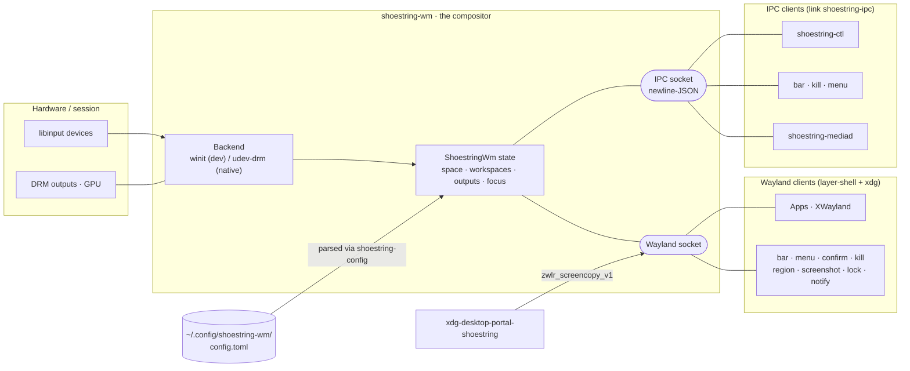
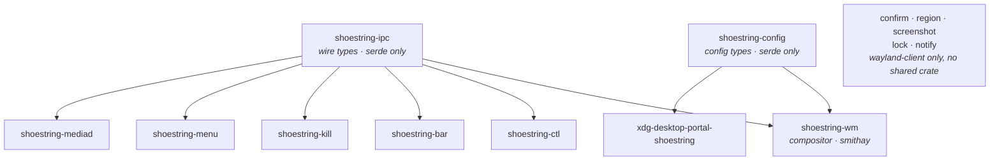
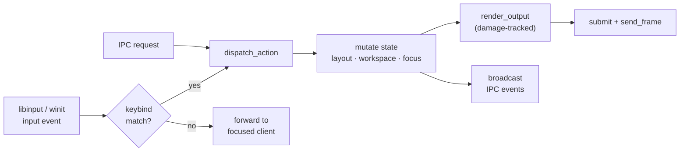

# shoestring-wm — Architecture

shoestring-wm is a lightweight, low-dependency Wayland compositor built on
[Smithay](https://github.com/Smithay/smithay). It replaces an Openbox/X11
desktop with a floating, manually-snapped workflow, and ships with a small
fleet of single-purpose companion binaries (a bar, launcher, locker,
notifier, screenshot tools, an IPC client, and a desktop portal).

This document describes the architecture **as it stands approaching
v1.0.0**: the shape of the system, the decisions that produced it, and the
reasoning behind those decisions — so future changes can be weighed against
the same goals instead of rediscovering them. It is deliberately *not* a
changelog or a milestone history; what matters here is *why* the code is
shaped the way it is.

> Where this prose and the diagrams in §0 disagree, trust the diagrams;
> where either disagrees with the source, trust the source — and please fix
> the doc. The canonical references for the surfaces this file summarizes
> are `docs/ipc.rst` (the IPC contract) and `docs/configuration.rst` (the
> config schema).

## Guiding principles

These are the yardsticks every decision below answers to. A change that
erodes one of these should be treated as a regression, not a feature:

1. **Lightweight & low-dependency.** Small binary, small dependency tree,
   no async runtime. New dependencies are resisted; the few exceptions are
   deliberate and named (§2).
2. **Floating, Openbox-style ergonomics.** Floating windows with
   manual half-tile/maximize snaps and Super+drag move/resize. No tiling
   tree, no scrolling layout, no mandatory decorations.
3. **Observable & automatable.** The IPC surface is load-bearing, not an
   afterthought: the running compositor can be queried, scripted, and
   driven over a socket. This is what lets the WM (and the apps inside it)
   be tested and automated.
4. **Opt-in for anything invasive.** Screen capture, input automation, and
   idle tracking default *off* and are discoverable only when enabled, so a
   normal session can't be observed or poked by anything that reaches a
   socket (§11).
5. **Portable & systemd-optional.** Linux is the primary target, but every
   OS touchpoint degrades to a no-op when its facility is absent, so
   non-systemd Linux and the BSDs stay first-class.
6. **Spec-correct over bespoke.** Lean on smithay and standard protocols
   rather than hand-rolling. Where smithay is spec-correct but a conformance
   test disagrees, that is upstream's to fix — we do not fork (§13).

---

## 0. System Overview

shoestring-wm is one compositor process surrounded by small single-purpose
companion binaries. Almost everything is wired together over just two
sockets the WM owns — the **Wayland socket** (standard compositor
protocols) and the **IPC socket** (newline-delimited JSON, see
`docs/ipc.rst`) — plus a couple of D-Bus / PipeWire side channels.

### Process & protocol map

Who talks to the WM, and over which channel:



Note that a few helpers use **both** channels: `shoestring-bar` and
`shoestring-kill` draw via Wayland *and* consume the IPC stream (window
lists, workspace/focus events). `shoestring-notify` and the portal also
serve D-Bus interfaces; `shoestring-mediad` and the portal talk to
PipeWire.

### Crate dependency graph

The two dependency anchors are tiny **`serde`-only** library crates that
let companions speak the WM's wire/config formats without pulling in
smithay:



(Arrows read *"is used by"*. `wlcs-shoestring`, the WLCS test plugin, is
excluded from the workspace and depends on `shoestring-wm` itself.)

### Internal event & render loop

Inside the compositor, input, IPC, and rendering converge on the single
mutable state:



---

## 1. Goals & Non-Goals

**Hard requirements** — the floor for daily-driver use:

- Floating windows (no tiling tree; tmux handles tiling-within-terminal).
- Snap-to-half (Super+E/W), maximize (Super+M), minimize (Super+D),
  fullscreen.
- Super+drag for move/resize (compositor-initiated, Openbox-style).
- A configurable number of global virtual workspaces (default 16) with
  keybind switching.
- Multi-monitor with hotplug.
- No window decorations by default.
- A rich, config-driven keybinding system.
- A scriptable IPC surface (principle 3).

**Non-goals** (and why they stay out):

- **Animations / fancy transitions** — cost without serving the floating
  workflow.
- **Window-decoration polish** — server-side decorations exist (borders are
  configurable, off by default) but theming is not a focus.
- **A tiling layout engine** — fundamentally incompatible with the manual
  floating model (see Appendix A).

The companion bar, menu, and notifier are **not** non-goals: they live in
this repository's workspace (`crates/`) and are built by one
`cargo build --workspace`. They remain separate *processes* (and the bar
stays coupled to the WM's IPC, by design), but they are no longer separate
projects.

---

## 2. Stack & Dependencies

**Core.** Everything compositor-side is built on a single git-pinned
Smithay revision (`default-features = false`, features `wayland_frontend`,
`desktop`, `xwayland`). The heavy backend features are pulled in through our
own Cargo features rather than always-on:

- `winit` → `smithay/backend_winit` (+ `renderer_gl`): the nested
  development backend.
- `tty` → `backend_libinput`, `backend_udev`, `backend_drm`, `backend_gbm`,
  `backend_egl`, `backend_session_libseat`, `renderer_gl`, `renderer_multi`,
  plus `smithay-drm-extras`: the real session backend.
- `default = ["winit", "tty"]`. `gl` is a marker feature so the headless
  WLCS harness (which renders with smithay's dummy renderer) can still
  compile the GL-only capture helpers.
- `profile-with-tracy` (optional) compiles in a `tracing-tracy` layer; it is
  a complete no-op when off, so a normal build pays nothing.

`calloop`, `xkbcommon`, and the `wayland-*` crates are consumed through
smithay's re-exports, so their versions can never skew. **There is no tokio
or async runtime** — smithay is synchronous and the event loop is calloop;
IPC and subprocess plumbing ride calloop sources directly.

**Beyond smithay**, the dependency set is kept deliberately short: `clap`
(CLI), `tracing`(+`-subscriber`), `anyhow`/`thiserror`, `bitflags`,
`xcursor`, `notify` (config hot-reload), `regex` (window rules), `libc`, and
`serde_json`.

**Accepted low-dependency exceptions.** Image rendering is the one place we
took on weight on purpose: `fontdue` (the diagnostics-overlay text
rasterizer, also used by the client crates), `png`, and `resvg` (wallpaper
and icon decoding). These exist because the WM and bar must render themed
icons, SVG/PNG wallpapers, and overlay text without dragging in
fontconfig/freetype or a browser-sized graphics stack. `resvg` is the
heaviest single dependency; it is linked unconditionally but only exercised
when a wallpaper image is configured.

---

## 3. Crate Layout

The workspace is a compositor binary plus its companions. The split exists
so that **companions can speak the WM's wire and config formats without
linking smithay** — see the dependency graph in §0. The two anchor crates,
`shoestring-ipc` (Request/Response/Event wire types) and `shoestring-config`
(config schema + parser), depend on nothing but `serde`. Everything else
either links those (the IPC clients) or is a standalone `wayland-client`
helper.

```
shoestring-wm/                  (workspace root + the WM binary)
├── src/                        (the compositor)
│   ├── main.rs                 (CLI, backend selection, event loop)
│   ├── state.rs                (ShoestringWm — the whole compositor state)
│   ├── backend/                (winit.rs, udev.rs, shared output helpers)
│   ├── handlers/               (one file per Smithay protocol handler)
│   ├── input.rs, binds.rs      (input pipeline + keybind table)
│   ├── grabs/                  (move / resize / popup-touch grabs)
│   ├── layout.rs, workspace.rs (window geometry + 16 global workspaces)
│   ├── ipc.rs, metrics.rs      (IPC server + diagnostics registry)
│   ├── screencopy.rs, ext_screencopy.rs, remote_screenshot.rs, ...
│   └── (cursor, wallpaper, decorations, scale, xwayland, …)
└── crates/
    ├── shoestring-ipc/             (wire types — serde only)
    ├── shoestring-config/          (config types — serde only)
    ├── shoestring-ctl/             (reference IPC client)
    ├── shoestring-bar/             (status bar; Wayland + IPC)
    ├── shoestring-menu/            (launcher)
    ├── shoestring-{confirm,kill,region,screenshot,lock,notify}/  (helpers)
    ├── shoestring-mediad/          (PipeWire media-privacy monitor)
    ├── xdg-desktop-portal-shoestring/  (ScreenCast + Screenshot backend)
    └── wlcs-shoestring/            (WLCS test plugin; excluded from workspace)
```

`wlcs-shoestring` is excluded from the workspace on purpose: it instantiates
a second copy of smithay (with `renderer_test`) and is only ever built by
the dedicated WLCS CI job, so it must not burden a plain
`cargo build`/`clippy`/`--workspace` run.

---

## 4. State Model

The compositor is a single struct, **`ShoestringWm`**, carried by the
calloop event loop (`EventLoop<'static, ShoestringWm>`). There is no outer
`State { backend, wm }` wrapper: the loop's data *is* the WM. The TTY/udev
backend keeps its device state as a `#[cfg(feature = "tty")]
udev: Option<UdevData>` field on the struct; the winit backend installs its
own calloop sources at startup and keeps its handle outside the struct.
`ShoestringWm` is the type parameter for every Smithay generic
(`Seat<Self>`, `SeatState<Self>`, the handler delegates).

The struct's fields fall into a few groups:

- **Plumbing** — `display_handle`, `loop_handle`/`loop_signal`, the
  monotonic `clock` backing `wp_presentation`, the socket name.
- **Config** — the parsed `Config`, its source path, the compiled
  `BindingTable`, and the hot-reload watcher + debounce token.
- **Domain state** — the single `Space<Window>` (§5), `PopupManager`,
  `LayoutManager`, `WorkspaceManager`, `Wallpaper`, and the diagnostics
  overlay.
- **Smithay protocol states** — one per protocol (§11). Many are held only
  to keep their global registered for the session and are marked
  `#[allow(dead_code)]`; the load-bearing ones (keyboard-shortcuts-inhibit,
  the foreign-toplevel/ext-workspace hand-wired states, the gated capture
  states) are mutated by their handlers.
- **Input** — the `Seat`, cursor state, and per-device touch→output mapping.
- **Side channels & gates** — the optional `ipc::Server`, the `metrics`
  registry, and the runtime gates (`automation_enabled`,
  `screen_capture_enabled` and its shared `Arc<AtomicBool>` mirror).
- **In-flight operations** — maps of pending screenshots, pending
  `run_command` children, the armed window picker, and the modal confirm
  dialog, each keyed so the SIGCHLD/IPC completion can find its request.
- **Bookkeeping sets** — `sticky`, `always_on_top`, `rules_applied`,
  `pending_initial_center`, plus the XWayland WM handle.

Two constructors exist: `new` (opens a listening Wayland socket — the real
path) and `new_headless` (no socket; WLCS injects clients directly). They
share `new_inner`, so conformance runs against the exact same global setup
the real session uses.

---

## 5. Window Storage: a Single `Space<Window>`

**Decision:** one `Space<Window>` holds every *currently visible* window
across all outputs. Per-window state that isn't "where is it on screen
right now" lives beside the `Space`:

- `LayoutManager` owns each window's `LayoutState` (floating with a saved
  rect, half-tiled left/right, maximized, fullscreen) and the minimized set
  with the geometry to restore.
- `WorkspaceManager` owns which workspace a window belongs to and per-
  workspace focus history.
- Small `HashSet`s track orthogonal flags: `sticky`, `always_on_top`,
  `rules_applied`, `pending_initial_center`.

**Why one Space, not one-per-workspace?** Sixteen Spaces would mean mapping
every output into every Space and reconciling them on every monitor change —
16× the bookkeeping for no gain. Instead the invariant is simple: **the
windows mapped in the `Space` are exactly the windows on the active
workspace** (plus sticky windows, which are re-pinned to whatever workspace
becomes active). Switching a workspace unmaps the old set and maps the new
one. Off-workspace and minimized windows live only in the managers, not the
`Space`, which keeps rendering a plain "draw what's mapped" pass.

Window stacking (raise/lower, always-on-top) is expressed through smithay's
z-index on the `Space`, not a separate ordered list; always-on-top sits
between ordinary windows and the layer-shell top layer so bars and menus
stay reachable above it.

---

## 6. Workspaces

Workspaces are **global across all monitors** (default 16, configurable). A
window belongs to a workspace, not to a monitor+workspace pair; switching
the active workspace changes what every monitor shows at once. Each window
separately remembers the output it last lived on, so windows reappear on the
monitor they came from.

`WorkspaceManager` holds the workspace array, the global active id, and per-
workspace focus MRU. Switching workspace:

1. updates the active id,
2. unmaps the outgoing workspace's windows and maps the incoming set
   (sticky windows are exempt and simply reassigned),
3. restores focus to the new workspace's most-recently-focused window,
4. emits the IPC `workspace_changed` event and updates the `ext-workspace-v1`
   handles standard bars read.

Moving a window to another workspace is just reassigning its workspace id and
re-running the map/unmap for the affected outputs.

---

## 7. Outputs & Multi-Monitor

Outputs are smithay `Output`s mapped into the `Space`. Per-output data that
the rest of the WM (and the IPC layer) needs — the damage tracker, resolved
scale/transform, VRR state — is stashed in the `Output`'s user-data map so
it can be read without reaching into a feature-gated backend.

- **winit backend:** exactly one output, the nested window. Scale is pinned
  to integer 1 (winit's HiDPI guess otherwise breaks tiling math in nested
  dev sessions).
- **udev backend:** real connectors, created/destroyed on hotplug. New
  windows orphaned by an output going away migrate to a surviving output.

Because workspaces are global (§6) there is no per-output active-workspace
field; the *focused* output is what determines where new windows spawn and
where half-tiling operates. HiDPI is handled through `wp_viewporter` +
`wp_fractional_scale_manager_v1`, so clients render crisp at the exact
fractional scale while legacy `wl_output.scale` clients see the rounded
integer.

---

## 8. Input & Keybindings

Input arrives from libinput (TTY) or winit and runs through
`process_input_event`. The keyboard pipeline reuses Smithay's
`keyboard.input()` filter: a closure runs on every key **before** the event
is forwarded to the focused client, matches it against the compiled
`BindingTable`, and either intercepts (dispatching an `Action`) or forwards.

Two subtleties are load-bearing and easy to break:

- The keybind filter runs *before* smithay installs the input-method
  keyboard grab, so Super-binds keep working while an IME (fcitx5/ibus) is
  active.
- Bindings match on the pre-modifier keysym (the raw level), so
  `Shift`-letter binds resolve correctly instead of matching the shifted
  symbol.

A focused client can ask, via `zwp_keyboard_shortcuts_inhibit_v1`, for the
WM to *stop* intercepting binds so every key reaches it — needed by nested
compositors, VMs, and remote-desktop viewers. We grant every request but only
ever activate the inhibitor on the surface that currently holds keyboard
focus.

**Pointer.** Move and resize are **compositor-initiated** grabs triggered by
Super+left/right-drag (`grabs/`), not client-initiated xdg-shell requests —
this is the Openbox model. The pointer path also drives touch, tablet/stylus
(`zwp_tablet_manager_v2`), touchpad gestures, and pointer
lock/confinement + relative motion (for games and remote desktop).

---

## 9. Window Operations

Geometry lives in `layout.rs`. Given the active window's output usable
rectangle `r` (which accounts for layer-shell exclusive zones such as the
bar), the core actions are:

| Action | Position | Size | Notes |
|---|---|---|---|
| Tile-left | `(r.x, r.y)` | `(r.w/2, r.h)` | saves prior floating rect |
| Tile-right | `(r.x + r.w/2, r.y)` | `(r.w/2, r.h)` | saves prior floating rect |
| Maximize | `(r.x, r.y)` | `(r.w, r.h)` | toggles back on re-press |
| Fullscreen | output rect | output rect | bypasses layers (§11) |
| Minimize | unchanged | unchanged | unmapped from the `Space` |

Re-pressing maximize/tile while already in that state restores the saved
floating rectangle — the Openbox feel. `arrange`/`set_layout`/`apply_geometry`
compute the target rect, map the element, and send the `xdg_toplevel`
configure. The tiling math is covered by property tests (`proptest`) over
`arrange_rects`.

Half-tiling operates on the focused window's **current monitor only**, never
spanning outputs.

---

## 10. Backends & the Render Loop

The backend is chosen once at startup by `BackendKind` in `main.rs`: `winit`
when `WAYLAND_DISPLAY`/`DISPLAY` is set (nested dev), otherwise `tty`
(udev/DRM, the real session). Each backend wires its own calloop sources;
there is **no `Backend` trait or dispatch enum on the hot path** — two
backends don't justify the abstraction, so the divergence is confined to
startup and the per-frame submit. Only the `tty` backend integrates with the
surrounding session (pushing `WAYLAND_DISPLAY`/`DISPLAY` into the systemd
user manager); the nested winit backend must not clobber the session it runs
inside.

Per-output render pass:

1. collect render elements — active-workspace windows (z-ordered by the
   `Space`), the output's layer-shell surfaces, the wallpaper as the
   bottom-most element, the cursor, and optionally borders / the diagnostics
   overlay;
2. damage-tracked `render_output` (smithay handles damage and z-order);
3. submit (winit GL swap, or DRM page-flip);
4. `send_frame` to the rendered surfaces;
5. schedule the next redraw (winit `request_redraw`, or the DRM vblank).

Wayland clients are **flushed eagerly** after every dispatch, not only at
render time, so headless/SSH dev sessions and not-yet-visible nested windows
still get their replies. The one exception is the headless WLCS harness,
where eager flushing would send a `wl_display.sync` reply before injected
fake input has been applied — there, flushing is deferred to the end of the
loop iteration (matching smithay's `wlcs_anvil`).

`wp_presentation` timestamps come from hardware vblank on udev and from
submit time (best-effort) on winit.

---

## 11. Protocol Surface & Capability Gating

The compositor advertises a broad set of Wayland protocols — far more than
the four core actions — because "observable and integrable" is a goal. They
fall into three tiers by how they are exposed:

- **Always-on standard client protocols.** xdg-shell (+ decoration forced
  server-side, + activation, + foreign), wlr-layer-shell, the
  foreign-toplevel *list* and the hand-wired *management* protocol,
  `ext-workspace-v1`, wlr-virtual-pointer, cursor-shape, viewporter +
  fractional-scale, pointer-constraints/relative-pointer, tablet, pointer
  gestures, keyboard-shortcuts-inhibit, primary selection, the input-method
  trio (text-input/input-method/virtual-keyboard), and the XWayland shell.
  These are ordinary client capabilities, so they are unconditional.
- **Opt-in via config.** `ext_idle_notify_v1` and its companion
  `zwp_idle_inhibit_manager_v1` are created only when
  `idle_notifications_enabled` is set — inhibiting idle is meaningless with
  nothing advertising it, so the two are gated together.
- **Runtime-gated, default-off (the privacy stance).** Anything that can
  observe or drive the session without the user's active participation is
  off until explicitly enabled, and *absent* (not merely inert) while off:
  - The **screen-capture gate** controls whether the `zwlr_screencopy_v1`
    and `ext-image-copy-capture`/`ext-image-capture-source` manager globals
    are advertised at all. While off, a client cannot even discover the
    capability. A shared `Arc<AtomicBool>` mirror lets the ext-image globals'
    visibility filters track the gate without a `&self` borrow.
  - The **automation gate** guards the IPC input-synthesis and
    capture/exec methods (`inject_key`/`type`/`click`, `move_mouse`,
    `dispatch_action`, `screenshot`, `run_command`). Read-only IPC queries
    are never gated.

Both gates are **runtime-only**: flipping one over IPC never writes to disk,
so the config file stays the source of truth at the next start. This is the
same pattern for both, by design (principle 4). DRM-scanout facilities
(wlr-gamma-control) exist only on the `tty` backend; dmabuf import for GPU
clients runs on both the `tty` backend and the native `headless` backend
(off each one's renderer formats).

The IPC server itself (`ipc.rs`) is newline-delimited JSON over a unix
socket, served on a calloop `Generic` source per connection, with drop-on-
backpressure event subscribers. It is the contract the bar, `ctl`, and
automation all speak — see `docs/ipc.rst`.

---

## 12. Design Decisions

The decisions that shape the codebase, with the reasoning kept so they can be
revisited deliberately rather than by accident:

| Decision | Rationale |
|---|---|
| **Global workspaces** (not per-monitor) | Switching changes every monitor at once; matches the user's mental model and avoids per-output active-workspace state. |
| **Single `Space<Window>`** | "Mapped == on the active workspace" is a simple, cheap invariant; per-workspace Spaces would multiply output bookkeeping. |
| **TOML config** via serde | Lean, plain-text, enough for binds/rules; hot-reloaded via `notify` with a trailing-edge debounce. |
| **Unix-socket + line-JSON IPC** | Trivial to script from any language; the EventStream upgrade carries live events. The surface is a first-class goal, not a debug aid. |
| **`serde`-only anchor crates** | Companions deserialize WM wire/config types without linking smithay. |
| **Monorepo for siblings** | Bar/menu/notify build with `--workspace`; one version, one CI. They stay separate processes (the bar stays IPC-coupled on purpose). |
| **Backend chosen at startup, no trait** | Only two backends (winit dev, udev session); a trait/enum on the hot path would be overhead for no reuse. |
| **Capability gates default-off, runtime-only** | Capture/automation can't be enabled by anything that merely reaches a socket; the config file remains the source of truth. |
| **Compositor-initiated move/resize** | Openbox-style Super+drag, not client-initiated xdg-shell requests. |
| **Click-to-focus default** | Focus model is configurable (focus-follows-mouse / sloppy opt-in); click-to-focus is the safe default. |
| **Pinned smithay rev, never forked** | Smithay is pre-1.0 and churns; we bump intentionally. Spec-correct-but-failing conformance cases are upstream's, tracked as known-xfail (§13). |
| **New windows centered on the active monitor** | With a per-window stacking offset, matching Openbox placement. |

---

## 13. Risks & Ongoing Constraints

- **Smithay API churn.** Smithay is pre-1.0. We pin a single git rev (shared
  by the WM and `smithay-drm-extras`) and bump deliberately, reading the diff
  rather than tracking `main`.
- **No forking smithay.** When a WLCS conformance test fails because of
  smithay-core behavior that is itself spec-correct (anvil fails the same
  test identically), we record it as known-xfail and do **not** patch or
  fork. Forking would forfeit upstream fixes for marginal gain. Genuine bugs
  go upstream as PRs.
- **DRM/udev complexity.** This is where compositors break; the udev backend
  is the most intricate code and leans directly on anvil's patterns.
- **Low-dependency pressure.** Every protocol and every crate is tempting.
  New dependencies must justify themselves against principle 1; the image-
  rendering exceptions (§2) are the documented precedent for what "justified"
  looks like.
- **Portability gaps.** PAM (the locker) and some `/proc`-based metrics are
  Linux-shaped; the BSD path cfg-gates them (see `third_party/pam-client2`).
  New OS touchpoints must degrade gracefully when their facility is absent.

---

## Appendix A — Why not fork niri?

niri is a scrolling tiler. Its layout model is fundamentally incompatible
with a floating + manual-snap workflow. Forking it would mean either ripping
out most of its layout code (more work than starting fresh) or contorting the
workflow to fit. Starting from a small smithay base was cleaner — but niri
remains the best real-world reference for how to drive smithay at scale.

## Appendix B — Why not Sway?

Sway is i3-style manual tiling, C-based, and built on wlroots — more runtime
and a different language than this project wants. The floating model and the
Rust/Smithay foundation are deliberate choices, not incidental ones.
